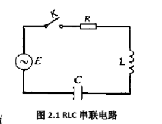

# RLC电路模型

例 1 设有一个由电阻 R，电感 L，电容 C 和电源 E 串联组成的电路（简称 R-L-C 串联电路）, 其中 R、L、C 为常数，电源电动势是E = $E_{m}$ sinwt，这里E及 $\omega$ 也 是常数（图 2. 1 )。求出 R -L -C 串联电路中电容 C 上的电压 $U_{c}(t)$ 所满足的微分方程。

解: 设电路中的电流为ict)，电容器所带的电量为Q( $t$,自感电动势为E_( $t$ )。

因而在 R-L-C 电路中各元件的电压降分别为:
$$
\left\{\begin{array}{c}
U_{R}=R i=R C U_{c}^{\prime} \\
U_{c}=\frac{Q}{C} \\
U_{L}=-E_{L}=L \frac{d i}{d t}=L C U_{c}^{\prime \prime}
\end{array}\right.
$$
根据基尔霍夫电压定律电压定律,得 $U_{R}+U_{c}+U_{L}=E,$ 将上述方程组代入该式，
得:
$$
L C U_{c}^{\prime \prime}+R C U_{c}^{\prime}+U_{c}=E
$$
即
$$
U_{c}^{\prime \prime}+\frac{R}{L} U_{c}^{\prime}+\frac{1}{L C} U_{c}=\frac{E_{m}}{L C} \sin \omega t
$$
这就是串联电路中电容 C 上的电压 $U_{c}(t)$ 所满足的微分方程。
如果电容 C 经充电后，撤去外接电源（即 E = 0）,
则上式成为:
$$
U_{c}^{\prime \prime}+\frac{R}{L} U_{c}^{\prime}+\frac{1}{L C} U_{c}=0
$$
matlab实现https://xueshu.baidu.com/usercenter/paper/show?paperid=6142ed4d6f18532c9e066ca0cd5309ef&site=xueshu_se

DOI：10.3969/j.issn.1007-2934.2011.02.026

基于 Matlabl的典型二阶RLC振荡电路实验教学仿真https://kns.cnki.net/kcms/detail/detail.aspx?dbcode=CJFD&dbname=CJFDLAST2017&filename=SYSY201610026&v=MTQ2MzlJTmpUWWQ3RzRIOWZOcjQ5SFlvUjhlWDFMdXhZUzdEaDFUM3FUcldNMUZyQ1VSN3FmYnVab0Z5N2hXN3Y=